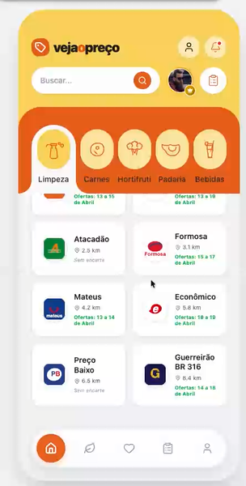

🛒 Veja O Preço
O **Veja O Preço** é um aplicativo iOS focado na experiência do usuário para consulta ágil de ofertas e controle de produtos. Desenvolvido com foco em alta performance e integração com o ecossistema Firebase (Firestore).

Este repositório não é apenas uma entrega técnica; é o reflexo do meu compromisso com a clareza, organização arquitetural e qualidade em cada linha de código, demonstrando o uso avançado de concorrência moderna (`async/await`) nativa do Swift.

🎯 O Projeto
O aplicativo foi construído para conectar usuários às ofertas do banco de dados em tempo real, permitindo a visualização de produtos de forma rápida, segura e elegante.

## 📱 Demonstração da Tela

*(A demonstração em vídeo pode ser vista localmente através do arquivo `App.mp4` que acompanha o projeto).*

## Principais Funcionalidades:

- **Exploração de Catálogo:** Uma lista completa e organizada de produtos com preço, validade e categorias.
- **Imersão Técnica:** Uso de `async/await` para consultas ultrarrápidas na internet, sem bloquear a interface gráfica.
- **Experiência Conectada:** Integração direta com Firestore, utilizando `compactMap` e protocolos `Codable` para garantir que as informações estejam sempre seguras e formatadas corretamente.
